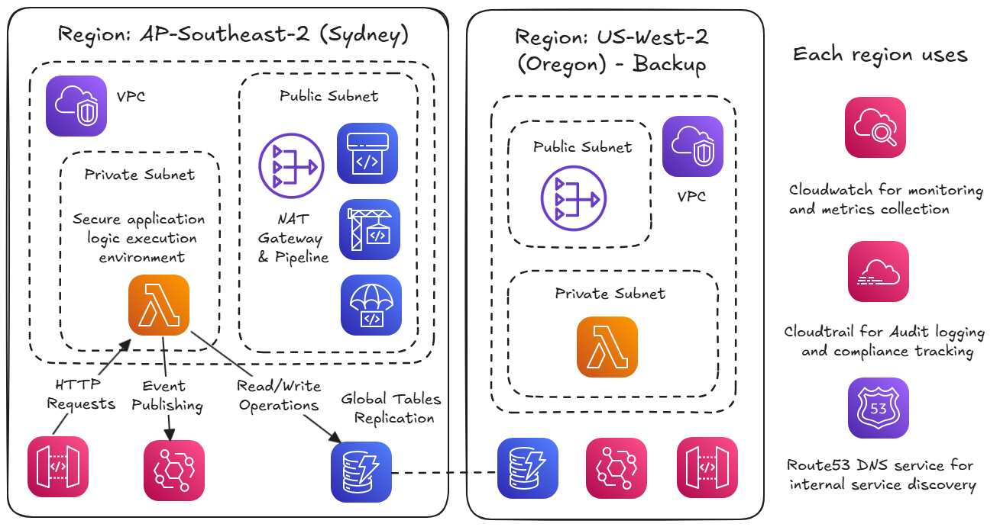
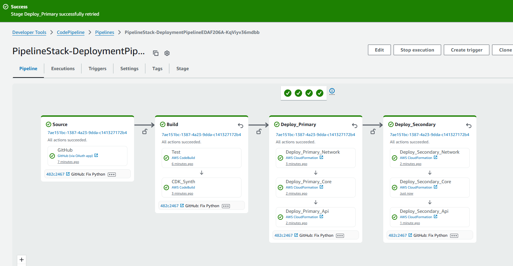
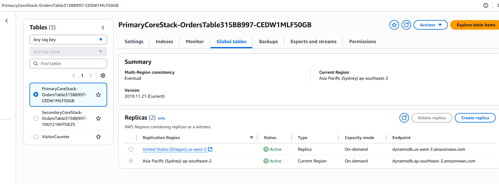
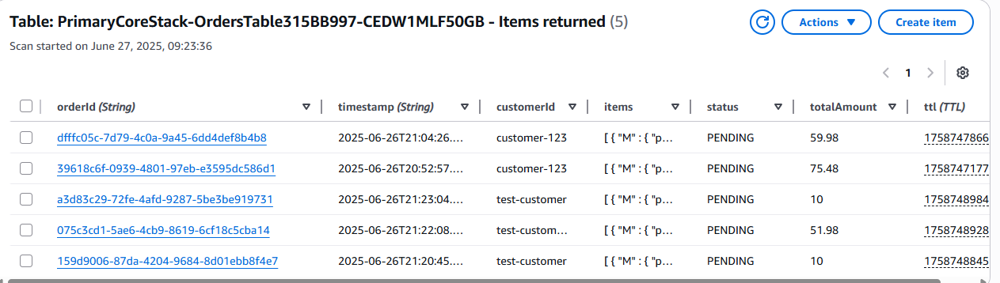

# AWS Multi-Region Event-Driven E-commerce Platform

This project is a hands-on implementation of a multi-region, serverless architecture on AWS. It showcases global high availability, disaster recovery, and automated CI/CD deployment pipelines. The stack leverages services such as AWS Lambda, API Gateway, DynamoDB Global Tables, S3, and CloudFront for a fully serverless backend, while AWS CodePipeline and CodeBuild handle continuous delivery across multiple regions.

Originally designed as an ecommerce proof of concept, the architecture is purposefully flexible and can be adapted for a wide range of applications — from APIs to event-driven platforms. This repository serves as both a learning resource and a reusable deployment blueprint for building globally resilient, low-maintenance, cloud-native applications.

## Architecture Overview

### Core Components

- **API Layer**: API Gateway with Lambda integrations for order processing
- **Event Processing**: EventBridge for centralized event routing and processing (ready for future expansion)
- **Data Storage**: DynamoDB Global Tables for multi-region data consistency
- **Workflow Management**: Step Functions for order orchestration
- **Service Mesh**: Multiple microservices handling different aspects of order processing

### Network Architecture

- **High Availability VPC**: Spans 3 Availability Zones for maximum resilience
- **Dual NAT Gateways**: Each AZ has its own NAT gateway to prevent single points of failure
- **Private Lambda Execution**: Secure application logic runs in isolated private subnets
- **Multi-Layer Security**: Public, private, and isolated subnet tiers for defense in depth

### Microservices

- Order Service (validation and creation)
- Inventory Service (stock management)
- Payment Service (transaction processing)
- Notification Service (customer communications)
- Shipping Service (fulfillment handling)

### Disaster Recovery

- Active-Active Multi-Region Configuration
- Automatic Failover with Route53 Health Checks (to be implemented)
- Cross-Region Event Replication
- Global Data Consistency with DynamoDB Global Tables

### CI/CD Pipeline

- Multi-Region Deployment Strategy
- Automated Testing and Validation
- Blue/Green Deployment Pattern
- Infrastructure as Code with CDK

## Technologies Used

- **Infrastructure**: AWS CDK (Python)
- **Compute**: AWS Lambda, Step Functions
- **Storage**: DynamoDB Global Tables
- **Messaging**: EventBridge
- **API**: API Gateway
- **CI/CD**: CodePipeline, CodeBuild, CodeDeploy
- **DNS**: Route53 with Health Checks
- **Monitoring**: CloudWatch, CloudTrail

## Event-Driven Architecture

The system leverages EventBridge as the central nervous system for event routing. This design provides:

- **Loose Coupling**: Services communicate through events rather than direct calls
- **Scalability**: Easy to add new event consumers without modifying producers
- **Future Expansion**: EventBridge is configured and ready for additional integrations such as:
  - Real-time analytics and reporting
  - Customer notification systems
  - Inventory management workflows
  - Third-party service integrations
  - Audit and compliance logging

## Network Design Rationale

### Why Dual NAT Gateways?

Each region deploys **2 NAT Gateways** across different Availability Zones to ensure:

- **High Availability**: If one AZ fails, Lambda functions in other AZs maintain internet connectivity
- **No Single Point of Failure**: Critical for production e-commerce systems requiring 99.9%+ uptime
- **Load Distribution**: Traffic is distributed across multiple AZs for better performance
- **AWS Best Practice**: Recommended pattern for production workloads

This design choice prioritizes reliability over cost, ensuring your e-commerce platform remains operational even during AZ-level outages.

## Project Purpose

This project serves as a comprehensive example of building cloud-native, event-driven systems with enterprise-grade reliability. It demonstrates:

- Event-Driven Architecture Patterns
- Multi-Region High Availability
- Infrastructure as Code Best Practices
- Modern CI/CD Workflows
- Production-Ready Service Design

## Getting Started

Detailed setup and deployment instructions can be found in the [Setup Guide](docs/setup.md).

---

For detailed technical documentation and implementation details, see the [Documentation](docs/) directory.

Project code is Agent assisted with RooCode - a Cline fork

## Screenshots

### Deployment Pipeline

### DynamoDB tables

