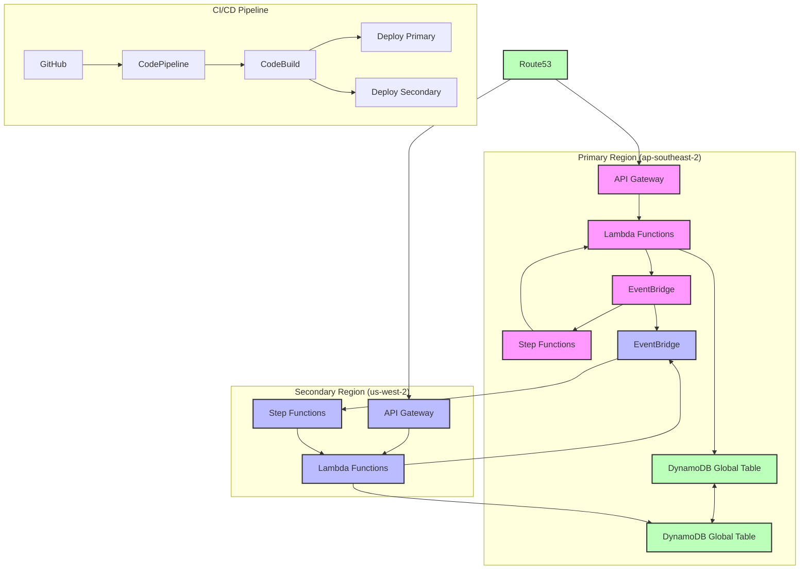

# Architecture Diagram

## Architecture Overview

This multi-region architecture provides high availability and disaster recovery capabilities through:

1. **Active-Active Configuration**

   - Both regions handle traffic simultaneously
   - Route53 health checks and DNS failover
   - Automatic traffic routing to healthy endpoints

2. **Data Consistency**

   - DynamoDB Global Tables for multi-region data replication
   - Eventually consistent read/write access in both regions
   - Automatic conflict resolution

3. **Event Processing**

   - EventBridge for event routing and processing
   - Cross-region event replication
   - Step Functions for workflow orchestration

4. **CI/CD Pipeline**

   - Automated multi-region deployments
   - Infrastructure as Code using CDK
   - Blue/Green deployment strategy

5. **Monitoring and Observability**
   - CloudWatch metrics and alarms
   - CloudTrail for API auditing
   - X-Ray for distributed tracing
